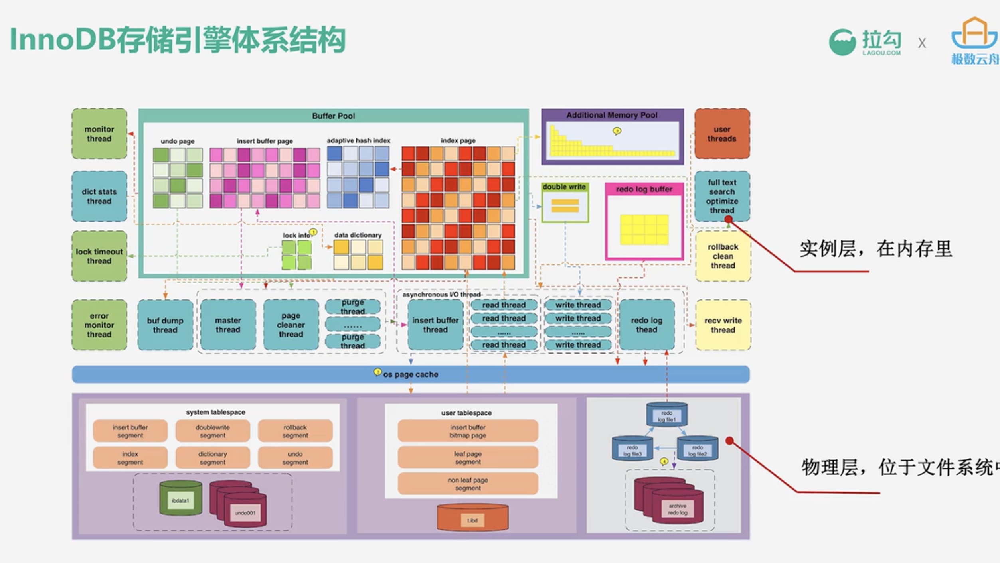

# 高性能MySQL实战

## MySql 体系结构与存储引擎
### Mysql 体系结构

### 存储引擎及其分类
存储引擎：MySQl中具体与文件打交道的子系统，根据 MySql AB 公司提供的文件访问层 抽象接口 定制的 一种文件访问机制

分类：
- 远古
  - MyISAM
- 支持事务
  - InnoDB
- 内存
  - Memory
  - NDB
- 列式存储
- ...

master thread:负责调度其他各线程，内部包含主循环（1s和10s）、后台循环、刷新循环
主循环的两种操作：
- 1s：
  - 第一步：日志缓冲刷新到磁盘（总是会操作，即使事物还未提交）
  - 第二步：最多可能刷100个新脏页到磁盘
  - 第三步：执行合并改变缓冲的操作
  - 第四步：若当前没有用户活动，可能切换到后台循环等

## MySql 事务与锁机制
什么是事务：事务指作为单个逻辑工作单元执行的一系列操作，这些操作要么全做要么全不做

事务的四个特性（ACID）：
- 原子性：所有操作要么都完成，要么都不完成
- 持久性：事务完成后，事务所做的修改持久化保存，不会丢失
- 隔离性：当多个事务并发的访问数据库中的同一数据时，所表现出的相互关系
- 一致性：事务开始和完成后，数据库的完整性限制并未破坏

MySql 锁分类：
- 表级锁：开销小，加锁快，不会出现死锁，粒度大，锁冲突概率最高，并发度最低
- 行级锁：开销大，加锁慢，会出现死锁，，粒度最小，锁冲突概率最低，并发度最高
- 页级锁：开销和加锁时间介于表锁行锁之间，会出现死锁，粒度也是之间，并发度一般

MySql 中的表锁包括读锁和写锁

InnoDB 锁分类：
- 行锁
  - 共享锁
  - 排他锁
- 表锁
  - 意向共享锁
  - 意向排他锁
  - 自增锁

自增锁
- 属于表锁的一种，在 insert 结束后立即释放
- 可以通过执行 show engine innodb status  查看自增锁的状态信息

## 高性能数据库表应该如何设计
范式与反范式
范式是设计数据库结构中所要遵循的的规则和指导方法
- 第一范式 1NF：无重复的列
- 第二范式 2NF：属性完全依赖于主键
- 第三范式 3NF：属性不传递依赖于其他非主属性
- BC范式 BCNF：

反范式：范式设计的表无法满足性能需求时，需要根据业务场景，在范式的基础上灵活设计，考虑：业务场景、反应时间、字段冗余

对比：
- 范式
  - 没有数据冗余，更新容易
  - 表数量多
  - 查询数据需要多表关联时，性能低下
- 反范式
  - 冗余带来读取性能
  - 需要维护冗余数据
  - 对磁盘的消耗

基础规范与命名规范
统一规范：
- 默认 innoDB 引擎
- 默认字符集 utf8mb4
- 关闭大小写
- 开启 pre-table 表

禁用功能：
- enum、set
- blob、text
- 视图、event
- 存储过程、触发器

## 高性能索引
索引：存储引擎用于快速找到记录的一种数据结构

索引实际是物理数据页：数据库页大小（Page size）决定了一个页可以存储多少个索引以及需要多少页来存储指定大小的索引
索引可以加速检索速度，但同时也降低了插入、删除的速度，索引维护需要代价